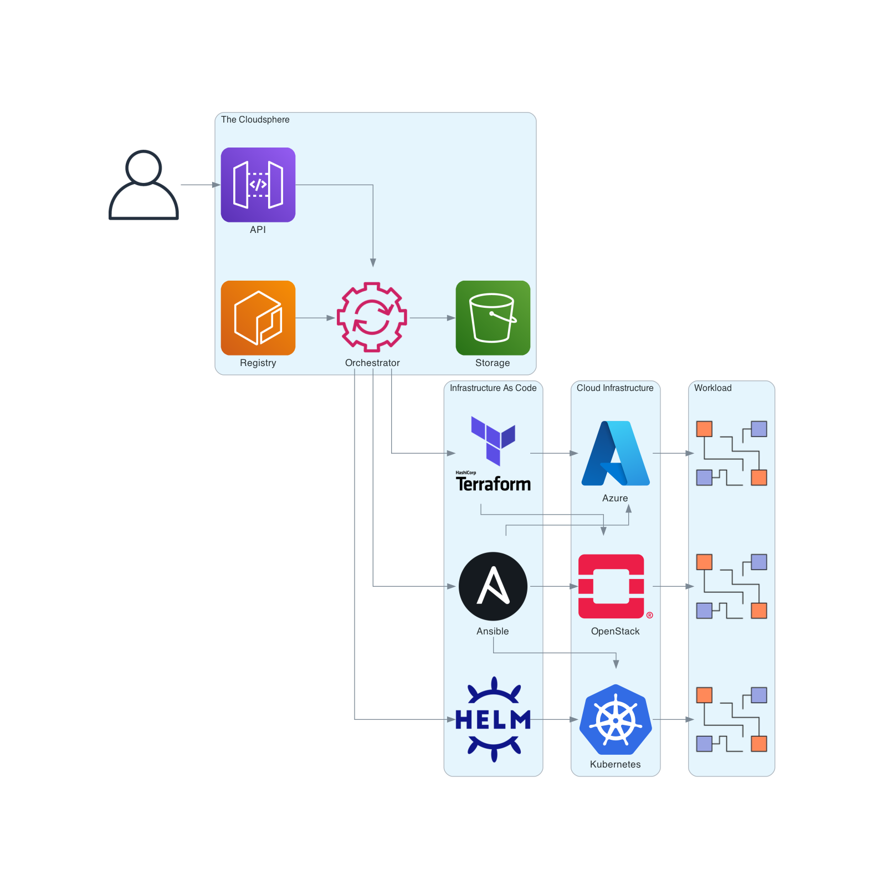
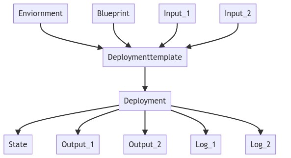
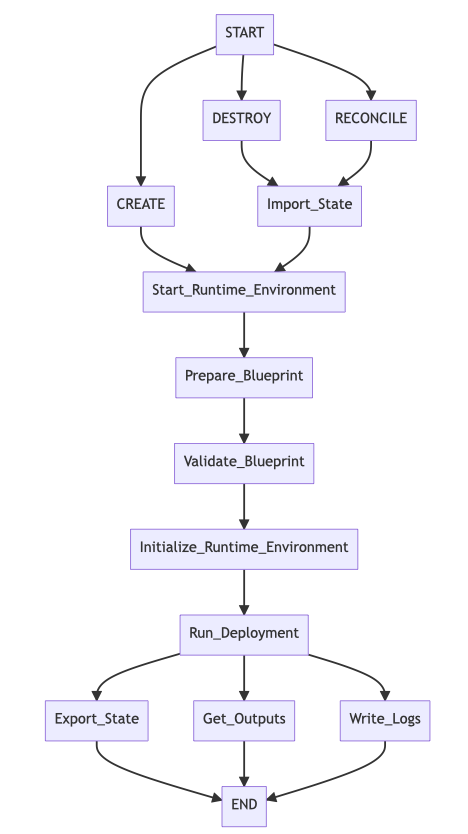

# Introduction

The Cloudsphere efficiently manages your cloud infrastructures 🚀

The Cloudsphere's mission statement is:

> Automate infrastructure as code (IaC) provisioning at any scale,
> at any cloud or data center with any tool. Through a single central
> API. Freely definable cloud infrastructures at the push of a button
> as self-service.

## Overview

## Terminology

### Environment

An environment contains all the necessary runtime components to
execute Infrastructure as Code contained in a Blueprint.

### Blueprint

A Blueprint contains everything needed to create a cloud infrastructure
in the form of Infrastructure as Code.

### Input

Blueprints, environments, and deployments can be passed any inputs at runtime.
These inputs are assembled in templates and then assigned.

### Template

### Deployment

A deployment executes an environment in a blueprint with a given
parameterization (template).

### State

### Log

Individual executions generate logs. For example, a deployment or a reconcilation.
The generated STDOUT and STDERR as well as the exit code are stored in the database.

### Output

## States

## Transitions

## Comparison with other solutions

### Atlantis

### CDK for Terraform

### Crossplane

### HashiCorp Cloud Platform

### Pulumi

### Red Hat Ansible Automation Platform / AWX
