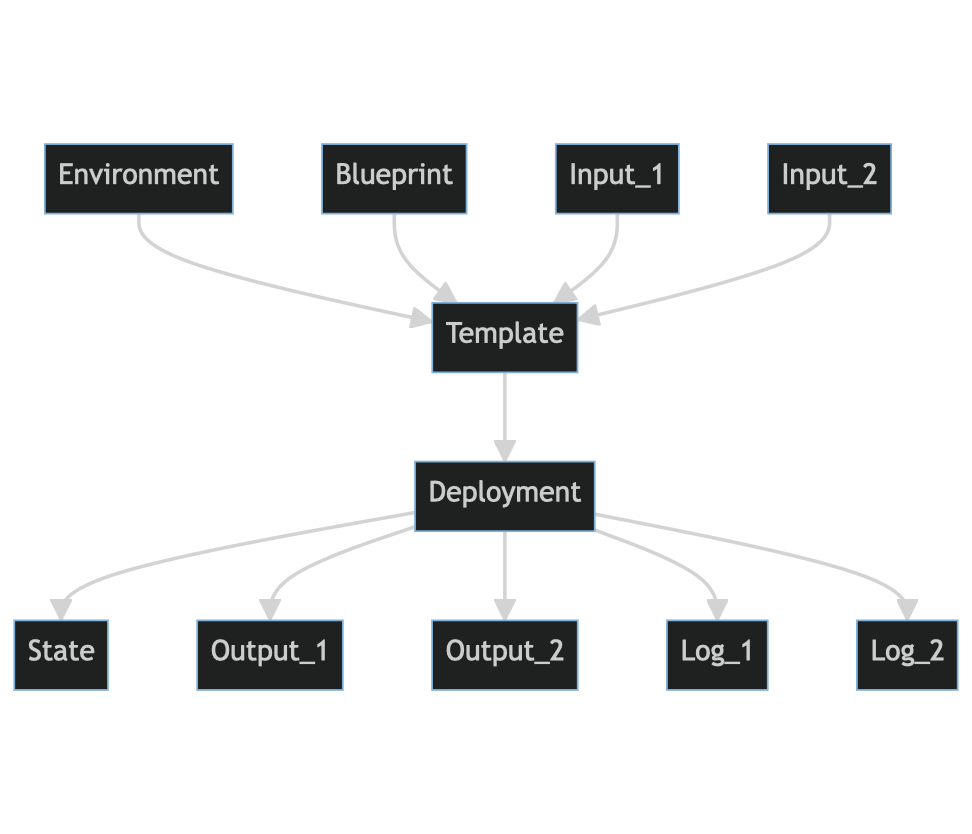

# Introduction

**The Cloudsphere** efficiently manages your cloud infrastructures 🚀

The Cloudsphere's mission statement is:

> Automate infrastructure as code (IaC) provisioning at any scale,
> at any cloud or data center with any tool. Through a single central
> API. Freely definable cloud infrastructures at the push of a button
> as self-service.

## Overview


### What is The Cloudsphere?

* an attempt to realise a small code base for API, orchestrator and runner
  services (less than 5000 SLOCs)

### What is The Cloudsphere <u>not</u>?

* an alternative to Infrastructure as Code tool X

## Terminology



### Environment

An environment contains all the necessary runtime components to
execute Infrastructure as Code contained in a Blueprint.

### Blueprint

A Blueprint contains everything needed to create a cloud infrastructure
in the form of Infrastructure as Code.

### Input

Blueprints, environments, and deployments can be passed any inputs at runtime.
These inputs are assembled in templates and then assigned.

### Template

### Deployment

A deployment executes an environment in a blueprint with a given
parameterization (template).

### State

### Log

Individual executions generate logs. For example, a deployment or a reconcilation.
The generated STDOUT and STDERR as well as the exit code are stored in the database.

For example, this is the output of Terraform, which is currently performing a ``DESTROY`` action.

```
data.openstack_networking_network_v2.public: Reading...
openstack_networking_network_v2.tcs: Refreshing state... [id=8ecd512b-6a74-4a99-8b6f-92ba27eff59a]
openstack_compute_secgroup_v2.tcs: Refreshing state... [id=6736b7d0-d5e9-4eb3-8469-3bc00b8e8cf9]
data.openstack_networking_network_v2.public: Read complete after 1s [id=e6be7364-bfd8-4de7-8120-8f41c69a139a]
openstack_networking_router_v2.router: Refreshing state... [id=8e662300-829d-41d2-ac6d-2ed453dfc4ec]
openstack_networking_subnet_v2.tcs: Refreshing state... [id=a80a6aab-3b2c-408e-a07f-04e4f8eec6cb]
openstack_networking_router_interface_v2.router_interface: Refreshing state... [id=747fa009-5b17-408b-91d4-918269e4baa1]
openstack_networking_floatingip_v2.tcs: Refreshing state... [id=c9140688-d76a-4ab8-8d9e-0fdae43c1149]
local_sensitive_file.address: Refreshing state... [id=d1db0a3767eb2585fcd53bb52df1081038e27ae7]

Terraform used the selected providers to generate the following execution
plan. Resource actions are indicated with the following symbols:
  - destroy

Terraform will perform the following actions:

  # openstack_compute_secgroup_v2.tcs will be destroyed
  - resource "openstack_compute_secgroup_v2" "tcs" {
      - description = "hello-world security group" -> null
[...]
```

### Output

## Actions, States, and Transitions


## Comparison with other solutions

### Atlantis

### CDK for Terraform

### Crossplane

### HashiCorp Cloud Platform

### Pulumi

### Red Hat Ansible Automation Platform / AWX
