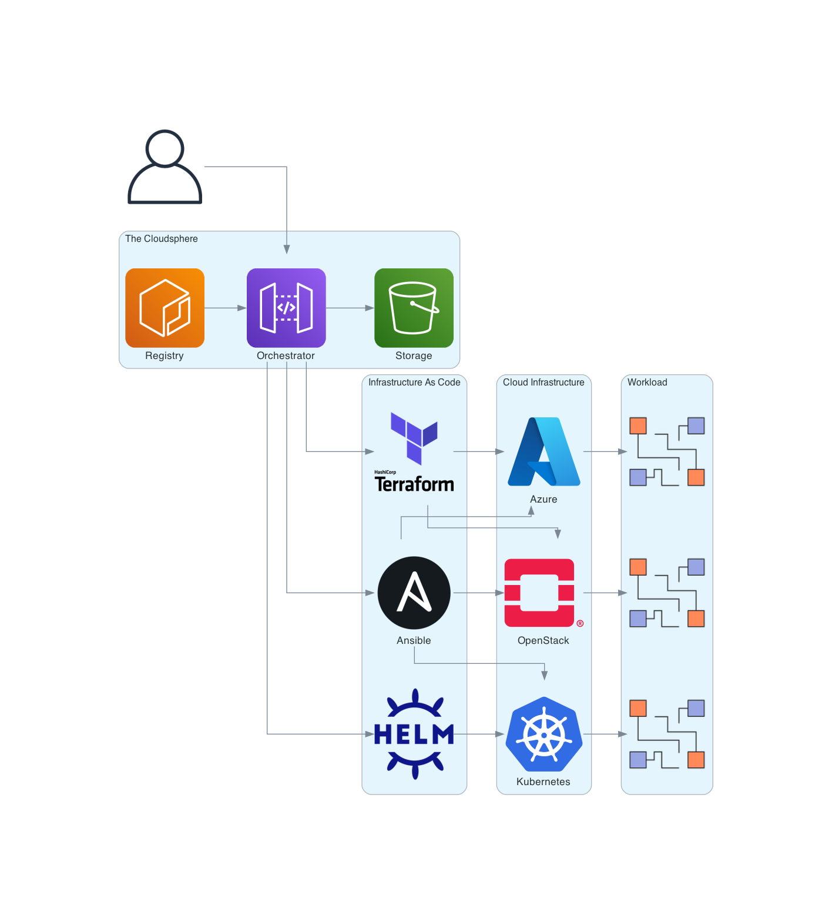

========
Overview
========

Terminology
===========

Environment
-----------

An environment contains all the necessary runtime components to
execute Infrastructure as Code contained in a Blueprint.

Blueprint
---------

A Blueprint contains everything needed to create a cloud infrastructure
in the form of Infrastructure as Code.

Deployment
----------

A deployment executes an environment in a blueprint with a given
parameterization (shell).

Input
-----

Both blueprints and deployments can be passed any inputs at runtime.
These inputs are assembled in shells and then assigned.

Log
---

Individual executions generate logs. For example, a deployment or a reconcilation.
The generated STDOUT and STDERR as well as the exit code are stored in the database.

Transitions
===========

.. figure:: images/transitions.png
